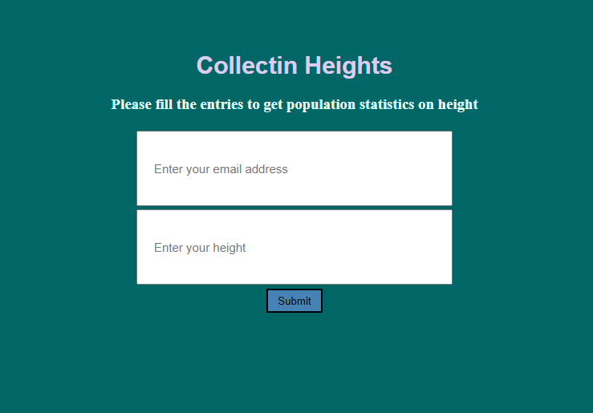

# Height Collector
This is a webpage that asks the user for their email and height and sends the user an email once the information has been collected and saved. The email sent, informs the user of the average height of all users who have already submitted their height and the total number of users that have submitted their height.

The main objective was to excercise the use of Flask, PostGreSql, classes within Python. Also practiced basic html and css within the templates and static folders.

### NOTE:
- A virtual python environment was used to work with a "fresh" install of python before installing Flask. The virtual folder was not included in the repository
- Height is assumed to be in cm.

Website is hosted [here](http://yuhboichin.pythonanywhere.com/)

